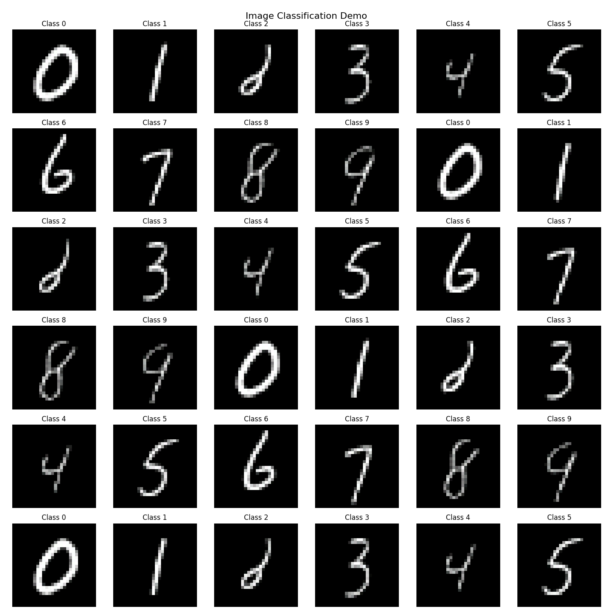

To train
```
python train.py
```

To sample
```
python sample.py --ckpt <path_to_checkpoint>
```

MNIST should look pretty good after ~70 epochs of training.

Architecture:

We use DiT blocks, with AdaLNZero conditioning.

For positional encoding, we just have a learnable embedding for each patch.




